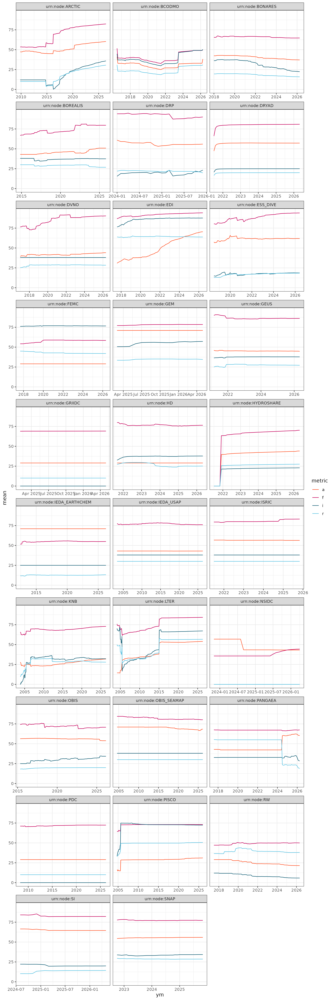

```{r setup, include=FALSE}
knitr::opts_chunk$set(echo = TRUE)
library(dplyr)
library(tidyr)
library(ggplot2)
library(scales)
library(tidyverse)
library(lubridate)
#library(flowers)
library(grid)
library(here)
library(patchwork)
library(gt)
devtools::load_all(here())
```

# Load FAIR metrics scores

These data are loaded from solr, and are calculated by the scorer. I recalculated aggregate scores by node from the raw check data and got very similar results so I see no reason not to trust them.

First we filter for the nodes we want. I went with nodes that have had new content since 2024. Up for discussion obviously. We also filter out the replica node and CANWIN. CANWIN has some oddly structured schema.org json and fails all checks.

```{r}
node_status <- read.csv("https://raw.githubusercontent.com/datadavev/mnstatus/refs/heads/main/data/node_status.csv") %>% 
  filter(as.Date(cn.latest) > as.Date("2025-01-01") | node_id == "urn:node:KNB") %>% 
  select(node_id, cn.count, cn.latest) %>% 
  filter(!(node_id %in% c("urn:node:mnUCSB1", "urn:node:CANWIN")))
```

Download the data from the scorer.

```{r}
data <- get_agg_data() %>% filter(datasource %in% node_status$node_id)
```

## Overall FAIR asssessment

Calculate all time scores on only non-obsoleted datasets.

```{r}
node_scores <- data %>% 
  filter(is.na(obsoletedBy)) %>% 
  get_node_scores_all_time()
```

Jump through many hoops to get the flower plots.

```{r}
repo_flowers <- node_scores %>%
  mutate(repo = fct_reorder(repo, score_100, .fun = mean, .desc = TRUE)) %>%
  split(.$repo) %>% 
  purrr::imodify( ~ make_flower_plot(as.data.frame(.x), title = .y))

# get scores across all dataone
all_repos <- node_scores %>% 
  group_by(label) %>% 
  summarise(score = mean(score, na.rm = T)) %>% 
  mutate(score_100 = score*100) %>% 
  mutate(label = factor(label, levels = c("Findable", "Accessible", "Interoperable", "Reusable"))) %>% 
  arrange(label)

central_master_plot <- make_flower_plot(
  all_repos, 
  title = "DataONE Network") +
  theme(
    plot.title = element_text(size = 28, face = "bold"), # Much bigger font
    text = element_text(size = 20) # Bigger mean text
  )

# optionally make lower scoring nodes anonymous  
#for (i in 13:length(repo_flowers)){
#  repo_flowers[[i]] <- repo_flowers[[i]] + ggtitle("")
#}
```

```{r}
p_base <- ggplot() + theme_void()

step_x <- 1 / 7   # 7 columns
step_y <- 1 / 6   # 6 rows


dashboard <- p_base + patchwork::inset_element(
  central_master_plot, 
  left   = 2 * step_x,  # Leaves 2 columns on the left
  bottom = 2 * step_y,  # Leaves 2 rows on the bottom
  right  = 5 * step_x,  # Leaves 2 columns on the right
  top    = 4 * step_y,  # Leaves 2 rows on the top
  clip   = FALSE
)

coords <- expand.grid(col = 1:7, row = 1:6)
coords <- subset(coords, !(col %in% 3:5 & row %in% 3:4))


coords$left   <- (coords$col - 1) * step_x
coords$right  <- coords$col * step_x
coords$bottom <- (coords$row - 1) * step_y
coords$top    <- coords$row * step_y

# Sort the plotting order from top-left to bottom-right
coords <- coords[order(-coords$row, coords$col), ]

# loop through plots and drop them onto the canvas
for (i in seq_along(rev(repo_flowers))) {
  dashboard <- dashboard + patchwork::inset_element(
    repo_flowers[[i]],
    left   = coords$left[i], 
    bottom = coords$bottom[i], 
    right  = coords$right[i], 
    top    = coords$top[i],
    clip   = FALSE
  )
}

ggsave(
  filename = "fair_dashboard_inset.png", 
  plot = dashboard, 
  width = 25, height = 25, dpi = 200, 
  bg = "white"
)
```


### Arctic Story - pre/post acadis

This is just a little side note explaining why the Arctic overall score is a little low at 52.

```{r}
arctic <- data %>% 
  filter(datasource == "urn:node:ARCTIC") %>% 
  mutate(prepost = if_else(dateUploaded < as.Date("2016-04-30"), "pre", "post")) %>% 
  group_by(prepost) %>% 
  filter(is.na(obsoletedBy)) %>% 
  summarise(Findable = mean(scoreFindable),
            Accessible = mean(scoreAccessible),
            Interoperable = mean(scoreInteroperable),
            Reusable = mean(scoreReusable),
            n = n()) %>% 
  pivot_longer(cols = c("Findable", "Accessible", "Interoperable", "Reusable"), names_to = 'label', values_to = 'score') %>% 
  mutate(score_100 = score*100)

arctic_flowers <- arctic %>%
  split(.$prepost) %>% 
  purrr::imodify( ~make_flower_plot(as.data.frame(.x), title = .y))

wrap_plots(arctic_flowers)
```

### Timeseries

Here we calculate rolling monthly means on all of the nodes. Then filter for nodes that have at least 10k metadata records and 5 years of data. These are plotted on top of the rest of the nodes, along with an overall rolling mean. I don't really love this plot, I think it brings up more questions than it answers and doesn't really have a clear point besides "there is lots of variability between nodes." I guess that is a point we'll want to make but I'm not sure if this is how we want to make it.

```{r}
node_timelines <- data %>% 
  group_by(datasource) %>% 
  group_modify(~ get_scores_rolling_mean_ym(.x)) %>% 
  ungroup() %>% 
  mutate(repo = gsub("urn:node:", "", datasource)) 

node_filtered <- node_timelines %>%
  group_by(repo) %>% 
  filter(sum(num_mean, na.rm = TRUE) >= 10000) %>% 
  filter(n_distinct(ym) >= 60)

node_nons <- node_timelines %>% 
  filter(!(datasource %in% unique(node_filtered$datasource)))

average_timeline <- get_scores_rolling_mean_ym(data)
```

```{r}
node_list_string <- paste0(
  "Target Nodes: ", paste(unique(node_filtered$repo), collapse = ", ")
)

ggplot() +
  # all individual nodes mapped in the background (thin, muted grey lines)
  geom_line(
    data = node_nons, 
    aes(x = ym, y = mean, group = repo, color = "Other Nodes"), 
    color = "gray", 
    linewidth = 0.5,
  ) +
  
  geom_line(
    data = node_filtered, 
    aes(x = ym, y = mean, group = repo, color = "Target Nodes"), 
    color = "aquamarine3", 
    linewidth = 0.7,
    alpha = 0.8
  ) +
  
  # node average mapped on top 
  geom_line(
    data = average_timeline, 
    aes(x = ym, y = mean, color = "DataONE Federation"), 
    color = "#ff3366", 
    linewidth = 1,
    alpha = 0.8
  ) +
  
  facet_wrap(~metric, ncol = 2, scales = "fixed") +
  
  scale_y_continuous(limits = c(0, 100), breaks = seq(0, 100, 25)) +
  scale_x_date(date_labels = "%Y", date_breaks = "2 years") +
  labs(
    title = "",
    x = "Upload Date",
    y = "Score",
    caption = node_list_string
  ) +
  
  scale_color_manual(
    name = "",
    values = c(
      "Other Nodes" = "grey85",
      "Target Nodes" = "turquoise3",
      "DataONE Federation"= "#ff3366"
    )
  ) +
  
  theme_bw(base_size = 13) +
  theme(
    plot.title = element_text(face = "bold", size = 16, margin = margin(b = 4)),
    plot.subtitle = element_text(color = "grey40", size = 11, margin = margin(b = 15)),
    strip.text = element_text(face = "bold", color = "grey20", margin = margin(t = 6, b = 6)),
    panel.grid.minor = element_blank(),
    panel.spacing = unit(1.5, "lines"),
    legend.position = "bottom",
    plot.caption = element_text(
      hjust = 0,             
      color = "grey40",      
      size = 9,              
      margin = margin(t = 15) 
    )
  )
```

### Rolling Mean using LOCF

Here's a different method to calculate the rolling mean, this time with a "state of the repository" monthly mean based on a Last Observation Carried Forward (LOCF) approach. Using this method, in each month, the most recent version of each dataset is selected. The score of this dataset is then filled across months in which no new version of that dataset appeared. When a dataset version is the most recent version of the dataset (has not be obsoleted by any other version), that version's score is filled from the month it was uploaded to present day. This method ensure that every month's mean consists of the mean of datasets that were the most recent versions in that particular month.

I do think this method is really interesting, and most accurately represents what is actually happening with the repositories. There are some interesting patterns here. Hydroshare used to have schema.org metadata that failed every check (format too mangled for our jq) but then fixed it. You can see bulk upload evidence in a few repos, including the ADC around our transition from ACADIS and in 2020, something major changed at LTER in 2015, and I think we'll see some interesting results from PANGAEA once we get more of their ISO records processed. 

Even with the parallel processing this takes a long time to run so be warned. I clocked it at 15 minutes or so. Because of that I checked the plot in.



```{r}
source(here("R/calc_node_scores.R")) # annoyingly we have to source the function if we are using parallel beacuse the package isn't installing right now
future::plan(multisession, workers = 36)

results_by_node <- data %>%
  split(.$datasource) %>%
  furrr::future_map_dfr(~ get_scores_monthly_state(.x), .id = "datasource")
# filter out months with less than 20 datasets total
locf_plot <- results_by_node %>% 
  filter(num_mean > 20)

```

Really big plot for exploration purposes.

```{r}
ggplot(locf_plot, aes(x = ym, y = mean, color = metric)) +
  geom_line() +
  scale_color_manual(
    values = c(
        "f"      = "#c70a61", 
        "a"    = "#ff582d", 
        "i" = "#1a6379", 
        "r"      = "#60c5e4"
    )) +
  facet_wrap(~datasource, ncol = 3, scales = "free_x") +
  theme_bw()


ggsave("all_nodes_timeline.png", width = 10, height = 30, units = "in")

```


## Curation Effects

To look at curation effects we first have to assign a sequence id to all the dataset versions. This is fairly quick but still takes around 2 minutes to run.

```{r}
data_seq <- assign_sequence_id(data) 
data_ver <- get_first_last_versions(data_seq)
```

```{r}
data_ver <- data_ver %>% 
  filter(version_position != "only_version")
```

For these timeseries, I think it probably makes most sense to use the actual rolling mean, since this is fundamentally a different analysis than the LOCF. For now, looking at all nodes might be interesting

```{r}
version_timelines <- data_ver %>% 
  group_by(datasource, version_position) %>% 
  group_modify(~ get_scores_rolling_mean_ym(.x)) %>% 
  ungroup()

line_styles <- c(
  "first" = "dotted",
  "last"  = "solid"
)

fair_colors <- c(
  "Findable"      = "#c70a61", 
  "Accessible"    = "#ff582d", 
  "Interoperable" = "#1a6379", 
  "Reusable"      = "#60c5e4"
)

p <- ggplot(
  data = version_timelines, 
  aes(x = ym, y = mean, linetype = version_position, color = metric)
) +
  geom_line(linewidth = 0.5, alpha = 0.8) + 
  facet_wrap(~datasource, ncol = 2, scales = "free_x") +
  scale_linetype_manual(values = line_styles) +
  scale_color_manual(values = fair_colors) +
  theme_bw() +
  labs(
    title = "",
    linetype = "Version",
    color = "FAIR Metric",
    x = NULL,
    y = "Score"
  ) +
  theme(
    legend.position = "bottom",
    legend.box = "vertical",
    plot.title = element_text(hjust = 0.5, face = "bold"),
    strip.text = element_text(face = "bold", size = 10)
  )

ggsave("curation_effect_timelines.png", p, width = 10, height = 30, units = "in")
```

Looking more closely at a few key nodes...

I'm still not super happy with this. The figure is better but I'm not sure what it says, if anything, across the network.

```{r}
target_nodes <- c("urn:node:ARCTIC", "urn:node:KNB", "urn:node:ESS_DIVE", "urn:node:EDI")

target_timelines <- version_timelines %>% 
  filter(datasource %in% target_nodes) %>% 
  mutate(
    line_group = interaction(datasource, version_position)
  )

target_ribbon <- target_timelines %>%
  select(-num_mean, -num_cum_mean) %>% 
  pivot_wider(
    id_cols = c(ym, datasource, metric), 
    names_from = version_position,
    values_from = mean
  ) %>% 
  group_by(datasource, metric) %>%
  arrange(ym) %>%
  fill(first, last, .direction = "down") %>% 
  ungroup()

ggplot(
  data = target_timelines, 
  aes(x = ym, y = mean)
) +
  geom_ribbon(
    data = target_ribbon,
    aes(x = ym, ymin = first, ymax = last, fill = datasource, group = datasource),
    inherit.aes = FALSE, 
    alpha = 0.25
  ) +
  
  geom_line(
    aes(color = datasource, linetype = version_position, group = line_group), 
    linewidth = 0.2, 
    alpha = 1
  ) +
  facet_wrap(~metric, ncol = 2, scales = "free_x") +
  scale_linetype_manual(values = line_styles) +
  scale_color_viridis_d(option = "mako", begin = 0.2, end = 0.7) +
  scale_fill_viridis_d(option = "mako", begin = 0.2, end = 0.7) + 
  
  theme_bw() +
  labs(
    title = "FAIR Metric Evolution Over Time Across Repositories",
    linetype = "Version",
    x = NULL,
    y = "Score"
  ) +
  theme(
    legend.position = "bottom",
    legend.box = "horizontal",
    strip.text = element_text(face = "bold", size = 10),
    panel.grid.minor = element_blank()
  ) +
  guides(color = "none", fill = "none")
```

```{r}
ggsave("fair_first_last_versions.png", p, width = 10, height = 8, units = "in")
```

Here's the curation effect averaged over time.

```{r}
data_change_avg <- data_ver %>% 
  group_by(datasource, version_position) %>% 
  summarise( n= n(),
             Findable = mean(scoreFindable),
             Accessible = mean(scoreAccessible),
             Interoperable = mean(scoreInteroperable),
             Reusable = mean(scoreReusable), .groups = "drop") %>% 
  pivot_longer(cols = c(Findable, Accessible, Interoperable, Reusable), names_to = "metric", values_to = "mean") %>% 
  mutate(datasource = gsub("urn:node:", "", datasource)) %>% 
  mutate(mean = mean*100)

trajectory_data <- data_change_avg %>%
  select(datasource, metric, version_position, mean) %>%
  pivot_wider(names_from = version_position, values_from = mean) %>%
  mutate(
    score_change = case_when(
      last > first ~ "Increased",
      last < first ~ "Decreased",
      TRUE         ~ "No Change"
    )
  ) %>%
  select(datasource, metric, score_change)

data_enhanced <- data_change_avg %>%
  left_join(trajectory_data, by = c("datasource", "metric")) %>%
  mutate(datasource = forcats::fct_reorder(datasource, mean))

```

```{r}
ggplot(data_enhanced, aes(x = mean, y = datasource)) +
  geom_line(aes(group = datasource, color = score_change), linewidth = 1.2) +
  geom_point(aes(shape = version_position), size = 3, color = "black") +
  facet_wrap(~ metric, scales = "free_x") +
  scale_color_manual(
    values = c(
      "Increased" = "#009E73", 
      "Decreased" = "#D55E00", 
      "No Change" = "gray70"
    ), 
  ) +
  scale_shape_manual(
    values = c(
      "first" = 1,  
      "last"  = 16  
    )
  ) +
  theme_bw() +
  labs(
    title = "FAIR Score Changes: Initial vs. Final Versions",
    x = "Mean Score",
    y = NULL,
    color = "Score Trajectory",
    shape = "Version State"
  ) +
  theme(
    legend.position = "bottom",
    legend.box = "vertical",
    panel.grid.minor = element_blank()
  ) +
  guides(color = "none")
```

```{r}
ggsave("FAIR-inital-final-mean.png", width = 10, height = 10, units = "in")
```


## What is the bigger driver, dialect, time, or version?

Just a quick pass at an ANOVA to see if we can model score. Normalized score within node to try and remove overall node effects. 

```{r}
df <- data_seq %>% 
  mutate(dialect = case_when(
    grepl("ecoinformatics", formatId) ~ "EML",
    grepl("isotc211", formatId) ~ "ISO",
    grepl("schema", formatId) ~ "SOSO"
  )) %>% 
  mutate(version_position = case_when(
    sequenceId == pid & is.na(obsoletedBy) ~ "singleton",
    sequenceId == pid & !is.na(obsoletedBy) ~ "first",    
    sequenceId != pid & is.na(obsoletedBy) ~ "last",      
    sequenceId != pid & !is.na(obsoletedBy) ~ "middle"   
  )) %>%
  pivot_longer(cols = starts_with("score"), names_to = "metric", values_to = "score") %>% 
  mutate(score_100 = score*100) %>% 
  mutate(metric = gsub("score", "",  metric)) %>% 
  filter(metric != "Overall")

```

```{r}
get_variance <- function(target_metric, data) {
  
  df_subset <- data %>% 
    filter(metric == target_metric) %>% 
    mutate(time_numeric = decimal_date(as.Date(dateUploaded))) %>%
    group_by(datasource) %>% 
    # normalize score within node
    mutate(
      score_normalized = score_100 - mean(score_100, na.rm = TRUE)
    ) %>% 
    ungroup()
  
  fit <- lm(score_normalized ~ time_numeric + dialect + version_position, data = df_subset)
  anova_results <- anova(fit)
  
  ss_total <- sum(anova_results$`Sum Sq`)
  
  data.frame(
    FAIR_Metric = toupper(target_metric),
    Driver = rownames(anova_results),
    Sum_of_Squares = anova_results$`Sum Sq`,
    Percent_Explained = (anova_results$`Sum Sq` / ss_total) * 100
  )
}
metrics_to_run <- c("Findable", "Accessible", "Interoperable", "Reusable")

all_variance_explained <- map_dfr(metrics_to_run, ~get_variance(.x, df))

gt::gt(all_variance_explained %>% arrange(Driver, FAIR_Metric))
```

## Repo classification with clustering

A brief attempt to try to cluster repos into different types according to number of recrods and number of versions per dataset that didn't go very far.

```{r}
repo_summary <- data %>% 
  group_by(datasource) %>% 
  summarise(unique_datasets = n_distinct(sequenceId),
            mean_versions_per_dataset = n() / n_distinct(sequenceId),
            .groups = "drop")
```

```{r}
cluster_data <- repo_summary %>%
  filter(unique_datasets > 100) %>% 
  mutate(log_datasets = log10(unique_datasets)) %>% 
  mutate(log_versions = log10(mean_versions_per_dataset))

repo_scaled <- scale(cluster_data %>% select(log_datasets, log_versions))

wss <- sapply(1:10, function(k){
  kmeans(repo_scaled, centers = k, nstart = 25)$tot.withinss
})
```

```{r}
plot(1:10, wss, type="b", pch = 19, frame = FALSE)
# 3
```

```{r}
set.seed(123) 

# nstart = 25 runs the algorithm 25 times with random initial centroids and picks the best one
fit_kmeans <- kmeans(repo_scaled, centers = 3, nstart = 25)

# Add the cluster assignments back to our data
final_clusters <- cluster_data %>%
  mutate(cluster = as.factor(fit_kmeans$cluster))
```


